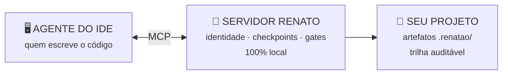
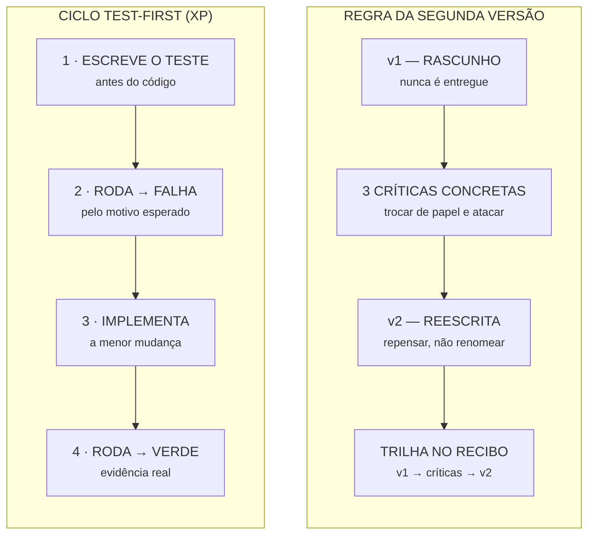

<div align="center">

# RENATO

### Seu agente de IA escreve rápido. O Renato faz ele escrever **certo**.

*Método de engenharia para a era dos agentes — memória persistente, protocolos executáveis
e gates que não aceitam "confia".*

[](LICENSE)
[](starter/tests/test_smoke.py)
[](https://modelcontextprotocol.io)
[](#filosofia)

**[📖 Leia o dossiê completo](https://erickwilliamdesousa.github.io/renato/)** — 18 seções: tese, arquitetura, protocolos, segurança, números e o modelo de trabalho

</div>

---

## O problema

Ferramentas de IA escrevem código numa velocidade impensável há dois anos. Mas velocidade
não é qualidade. O agente entrega a primeira versão que funciona — e quase todo mundo
aceita. O resultado é **protótipo disfarçado de produto**: "funciona na minha máquina",
segredo vazado no commit, e o mesmo erro repetido projeto após projeto, porque a IA
não lembra do que já foi decidido.

Disciplina de engenharia não pode depender de força de vontade — ainda mais quando quem
escreve o código é uma IA confiante e apressada. Documento se ignora, checklist se pula,
boa intenção se esquece. **Tem que virar sistema.**

## A tese: a escada de enforcement

Toda prática de engenharia sobe uma escada — e só descansa quando vira mecanismo:

```
documento → artefato → gate → verificação automática → métrica no tempo
(se esquece)                                        (sobrevive)
```

O trabalho do Renato é empurrar cada regra da casa o mais para a direita possível.
**Conselho se esquece. Mecanismo sobrevive.**

## Como funciona

O Renato é um cérebro central **local**: um servidor MCP + CLI determinística que se
conecta ao agente do seu editor (Antigravity, VS Code, Cursor — qualquer um que fale MCP).



Ele dá ao agente três coisas que faltam nele:

| Falta no agente | O Renato entrega |
|---|---|
| **Memória** | acervo local (SQLite FTS5 + embeddings) que atravessa sessões e projetos, com colheita automática ao concluir |
| **Método** | protocolos injetados *dentro da conversa*, roteados por classificação determinística — zero LLM no caminho crítico |
| **Cobrança** | gates que recusam: "pronto" sem evidência, deploy com eval falhando, Dockerfile sem healthcheck |

## Os dois ciclos centrais



Sem teste falhando primeiro, não há implementação. E a primeira versão que funciona
ancora o pensamento — por isso **a v1 nunca é entregue**. Código crítico (auth,
pagamento, dados) exige torneio de 3 abordagens julgadas.

## Manifesto — cada frase tem um mecanismo atrás

| A frase | O mecanismo |
|---|---|
| *"Funciona" é opinião. "Esse comando roda e sai isso" é fato.* | critério de aceite como contrato |
| *Conselho se esquece. Mecanismo sobrevive.* | a escada de enforcement |
| *A v1 nunca é entregue.* | Regra da Segunda Versão |
| *O autor jura. O adversário acha.* | revisão adversarial |
| *Container é gado, não bicho de estimação.* | guia do fluxo de deploy |
| *Backup que nunca foi restaurado é fé, não backup.* | backup com verificação de integridade |
| *A nota só sobe com mecanismo, nunca com promessa.* | Selo da Casa (A–F) |
| *Avaliação, não dogma: se PHP for a melhor saída, PHP vence.* | decisão de stack registrada |

## O que está aqui — e o que não está

Este repositório **não é o Renato inteiro**. É o conceito completo + uma semente funcional:

| ✅ Aberto (aqui) | 🏠 Em casa (não publicado) |
|---|---|
| O método e os protocolos, na íntegra conceitual | As 1.200+ skills indexadas |
| A arquitetura e todas as decisões | Os evals e o Selo da Casa de produção |
| Um starter MCP **funcional** (~300 linhas, testado) | A memória acumulada — o acervo é de quem constrói o seu |
| Os templates de artefatos | Segredos e chaves — **sempre** |

A ideia: você não clona o Renato — você **inicia o seu**. O caminho está mapeado;
a caminhada (e o acervo que ela gera) é sua.

## Comece agora

**Nunca programou?** Sem problema — o guia foi feito pra você:
**[Do zero ao Renato funcionando](starter/README.md)** — baixar o ZIP, instalar o
Python, dar **duplo clique em `INSTALAR.bat`** (ele instala tudo, roda os testes
e gera a configuração do Antigravity prontinha) e dar o primeiro comando. ~10 min.

**Já é dev?**

```bash
git clone https://github.com/ErickWilliamDeSousa/renato.git
cd renato/starter
pip install -r requirements.txt
python -m pytest tests/ -q     # a semente nasce verde: 15 testes
python servidor_mcp.py         # servidor MCP no ar
```

Config por editor, exemplo de sessão e guia de extensão: [manual do starter](starter/README.md#para-quem-é-técnico).

## Documentação

| Doc | O que responde |
|---|---|
| [📕 Dossiê completo (página)](https://erickwilliamdesousa.github.io/renato/) | tudo, com a narrativa inteira — comece por aqui |
| [Manifesto](docs/MANIFESTO.md) | as frases da casa e o mecanismo por trás de cada uma |
| [Arquitetura](docs/ARQUITETURA.md) | componentes, o fluxo de uma tarefa (9 passos, 6 gates) |
| [Roteamento](docs/ROTEAMENTO.md) | por que zero LLM no caminho crítico |
| [Memória](docs/MEMORIA.md) | recall híbrido (FTS5 + embeddings + RRF), colheita, honestidade sobre dados |
| [Artefatos](docs/ARTEFATOS.md) | a papelada que trabalha: GSD, recibo, evals, selo |
| [Segurança](docs/SEGURANCA.md) | defesa em profundidade: 8 ameaças → 8 camadas |
| [Protocolo test-first](docs/PROTOCOLO_TEST_FIRST.md) | o ciclo como gate, não como conselho |
| [Protocolo Segunda Versão](docs/PROTOCOLO_SEGUNDA_VERSAO.md) | v1 → críticas → v2, e o torneio |
| [Protocolo adversarial](docs/PROTOCOLO_ADVERSARIAL.md) | 3 hipóteses de quebra + caça ao falso-feito |
| [Guia de projeto novo](docs/GUIA_PROJETO_NOVO.md) | o dia zero: fundação antes de funcionalidade |
| [Guia do fluxo de deploy](docs/GUIA_FLUXO_DEPLOY.md) | git → build → container → produção vigiada |
| [Guia de segurança](docs/GUIA_SEGURANCA.md) | o essencial para não ser invadido no primeiro mês |
| [Leve para o seu time](docs/ADOCAO.md) | o método **sem** a ferramenta: uma prática por semana |
| [FAQ](docs/FAQ.md) | as objeções de sempre, respondidas sem marketing |

## Filosofia

> **"A vida é isso: conhecimento só serve se compartilhado."**

O Renato nasceu de uma necessidade real: trabalho solo, várias empresas e projetos ao
mesmo tempo, e a urgência de transformar velocidade de IA em software de verdade. Ele
não nasceu para ser exclusivo. Os segredos e as chaves ficam em casa — **o conhecimento, não**.

Use, adapte, melhore — e repasse.

## Licença

[MIT](LICENSE) — feito em português, no Brasil, com método brasileiro:
avaliação em vez de dogma, evidência em vez de juramento — **e a porta aberta**.
