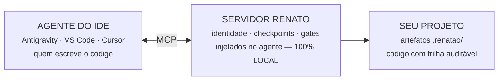

# Arquitetura — ele não escreve código: injeta contexto e cobra método

O Renato é um **cérebro central externo, IDE-first**: um servidor MCP + CLI
determinística (Python) que se conecta ao agente do seu editor (Antigravity, VS Code,
Cursor). A identidade, os checkpoints e os gates chegam **dentro da conversa do
agente** — não dependem de ele abrir arquivo nenhum.

## O núcleo — memória e segredos não saem da sua máquina

| Componente | O que faz |
|---|---|
| **Memória** | SQLite · FTS5 + embeddings · colheita automática |
| **Skills** | 1.200+ indexadas, servidas sob demanda |
| **Roteador** | keywords ponderadas · 0 LLM · determinístico |
| **Protocolos** | test-first · 2ª versão · adversarial · evals · selo |

O roteamento é **100% determinístico**: a tarefa é classificada por keywords
ponderadas — sem LLM no caminho crítico. Mesmo input, mesmos protocolos, sempre.
Determinismo aqui é feature: o agente pode ser criativo; o processo, não.

## O fluxo de uma tarefa: nove passos, seis gates

| # | Etapa | Tipo |
|---|---|---|
| 1 | **session_start** — identidade, memórias, playbooks e modo de trabalho injetados na conversa | passo |
| 2 | **recall + plano** — busca o histórico antes de reinventar; anuncia o plano; o humano aprova | passo |
| 3 | **pre-code** — classifica ANTES da 1ª linha: trivial / relevante / crítico | **GATE** |
| 4 | **test-first** — escreve o teste → roda → confirma a falha esperada → só então implementa | **GATE** |
| 5 | **pre-v2 · Segunda Versão** — v1 → 3 críticas → reescrita v2 (crítico: torneio antes) | **GATE** |
| 6 | **pre-test / pre-commit** — suíte verde de verdade; trilha v1→v2 conferida; commit semântico | **GATE** |
| 7 | **adversary + ship-check** — tenta quebrar o próprio trabalho; evals bloqueiam deploy | **GATE** |
| 8 | **deploy + postdeploy** — HEALTHCHECK obrigatório; smoke real em produção | **GATE** |
| 9 | **task_complete** — recusa "pronto" sem evidência recente; memória colhida automaticamente | **GATE** |

**O detalhe que muda tudo:** os gates não são texto que o agente pode ignorar.
O task_complete recusa recibo em branco; o ship-check bloqueia deploy com eval
falhando; o preflight reprova Dockerfile sem healthcheck. **Desobedecer dá trabalho —
obedecer é o caminho fácil.**

## E o sistema se cuida

- **720+ testes** sobre o próprio Renato e **21 evals-canário** ponta a ponta —
  inclusive governança: se uma regra sumir de um ponto de injeção, o sistema acusa sozinho.
- **Backup do cérebro** com verificação de integridade e rotação; sandbox de shell;
  detector de vazamento de segredos; teto diário de custo em chamadas pagas.
- **Manutenção mensal automática**: self-test profundo, evals, auditoria de
  dependências, varredura de produção e colheita de memória — sem depender de alguém lembrar.
