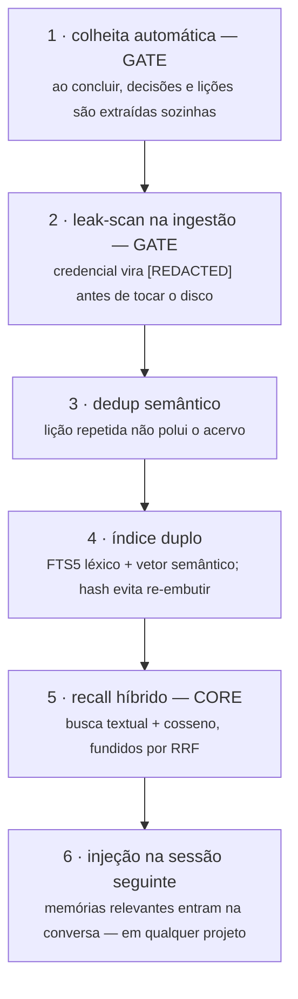

# Memória — que atravessa sessões e projetos

O agente nasce amnésico: fechou a conversa, esqueceu a decisão, o erro e a lição.
O Renato mantém um acervo que persiste — e que **volta sozinho na hora certa**.

## O pipeline de uma memória

## Por que dois índices

O **léxico** acha o termo exato: "coolify", o nome da função, a flag do comando.
O **semântico** acha o conceito: "app caiu depois do deploy" encontra "healthcheck
falhou em produção" sem dividirem uma palavra sequer. O **RRF** (fusão de rankings
recíprocos) junta as duas listas sem calibração frágil de pesos: quem ranqueia bem
nas duas, sobe.

## Honestidade sobre os dados

| O que fica | O que viaja | O que degrada |
|---|---|---|
| acervo SQLite, índices, segredos, backups — **na máquina** | o texto da memória → vetor, **sempre após o leak-scan** (opcional) | sem chave/internet, recall vira busca textual pura — **zero regressão** |

O acervo, o índice e os segredos ficam na máquina. Para gerar o vetor semântico, o
texto da memória viaja a uma API de embedding — **depois** do leak-scan. Sem chave ou
sem internet, o recall degrada para busca textual pura: menos esperto, **nunca quebrado**.

> Veja o conceito funcionando em ~100 linhas: [`starter/memoria.py`](../starter/memoria.py)
> (FTS5 + leak-scan + dedup — os embeddings são o degrau seguinte da escada)
