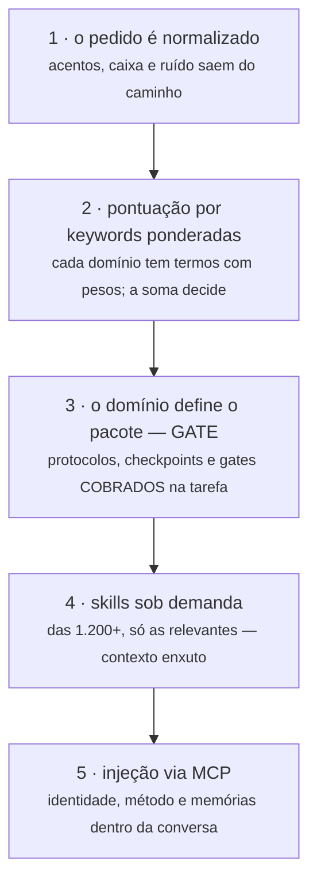

# Roteamento — o roteador é uma função, não um palpite

Quando uma tarefa chega, **nenhum modelo de linguagem decide o que fazer com ela**.
A classificação é determinística — e isso é uma escolha de engenharia, não uma limitação.

## Como uma tarefa vira método

1. **O pedido é normalizado** — acentos, caixa e ruído saem do caminho antes de
   qualquer decisão.
2. **Pontuação por keywords ponderadas** — cada domínio (deploy, revisão, segurança,
   projeto novo...) tem um conjunto de termos com pesos; a **soma** decide o vencedor.
3. **O domínio define o pacote** — protocolos, checkpoints e gates que serão
   **cobrados** naquela tarefa, não sugeridos.
4. **Skills sob demanda** — das 1.200+ skills indexadas, só as mais relevantes entram:
   contexto enxuto em vez de manual inteiro.
5. **Injeção via MCP** — identidade, método, memórias e gates entram **dentro da
   conversa do agente** — ele não precisa abrir arquivo nenhum.

## Por que determinismo é feature

**Mesmo pedido, mesmo processo — sempre.** Um roteador probabilístico erraria
diferente a cada dia, e ninguém audita palpite: aqui, auditar é ler uma tabela de
pesos, não interrogar um modelo. O custo é zero e a latência é desprezível, porque
não há chamada de rede no caminho crítico.

A divisão é deliberada: **a criatividade fica onde deve ficar** — no código que o
agente escreve, nas abordagens do torneio, na solução do problema. O processo que
cobra teste, evidência e revisão não improvisa. É a mesma lógica de um checklist de
aviação: o piloto decide muito; o checklist, nada.

## Regra da casa: zero LLM no caminho crítico

Roteamento, gates, selo e evals são **funções puras**: entrada → saída, testáveis
uma a uma. Chamada de modelo é periférica e opcional (vetores de memória, geração
de imagem) — **nunca decide o método**.

> Veja o conceito funcionando em ~90 linhas: [`starter/roteador.py`](../starter/roteador.py)
