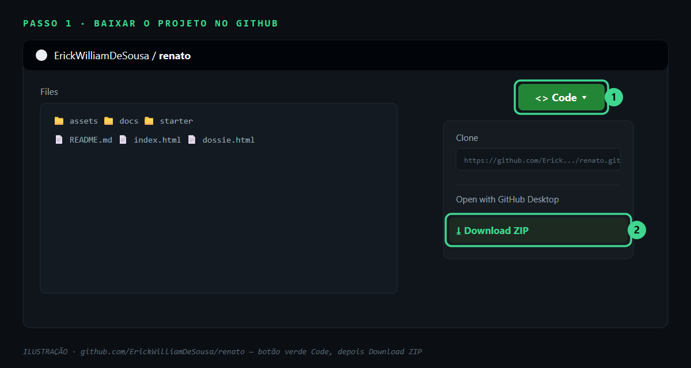
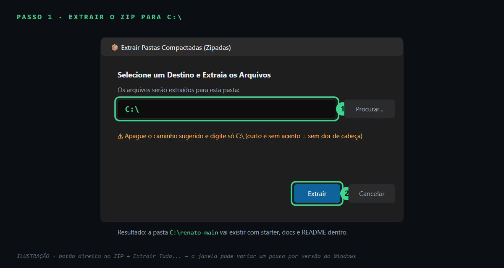
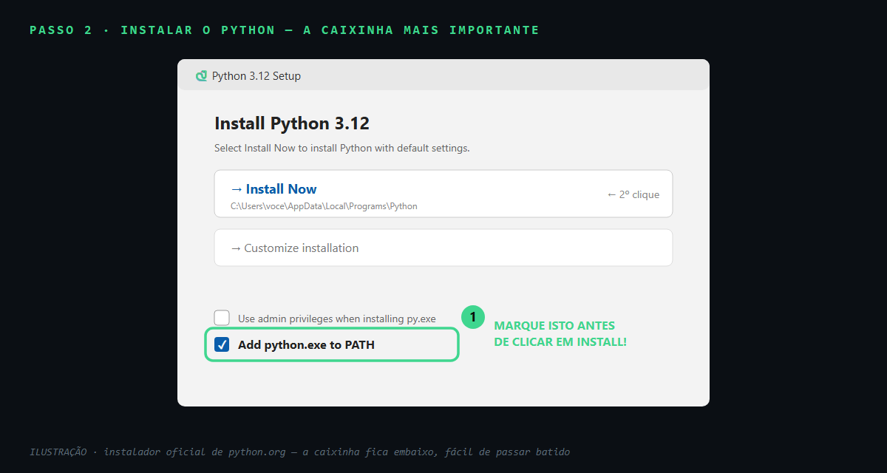
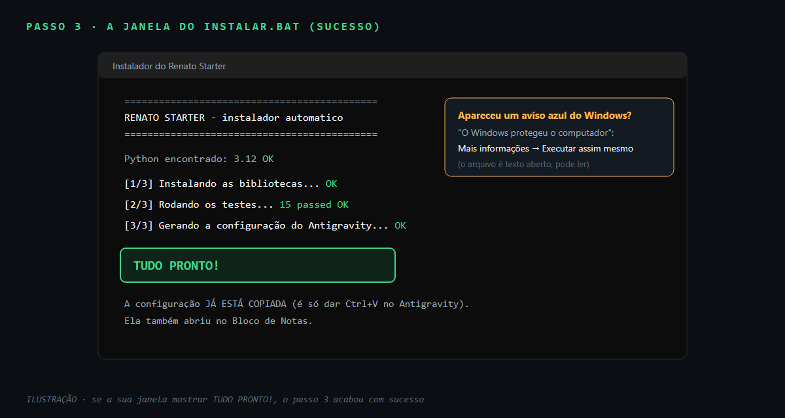
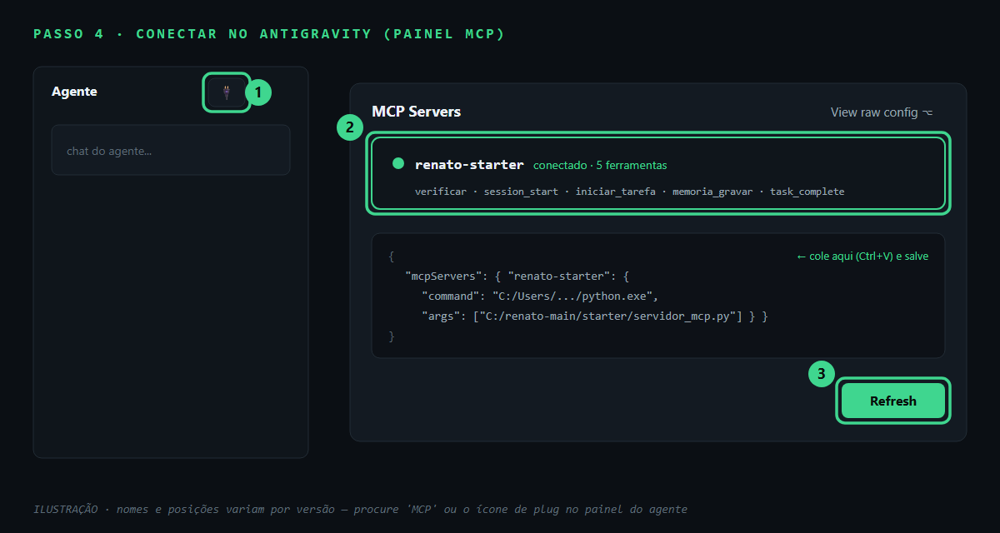
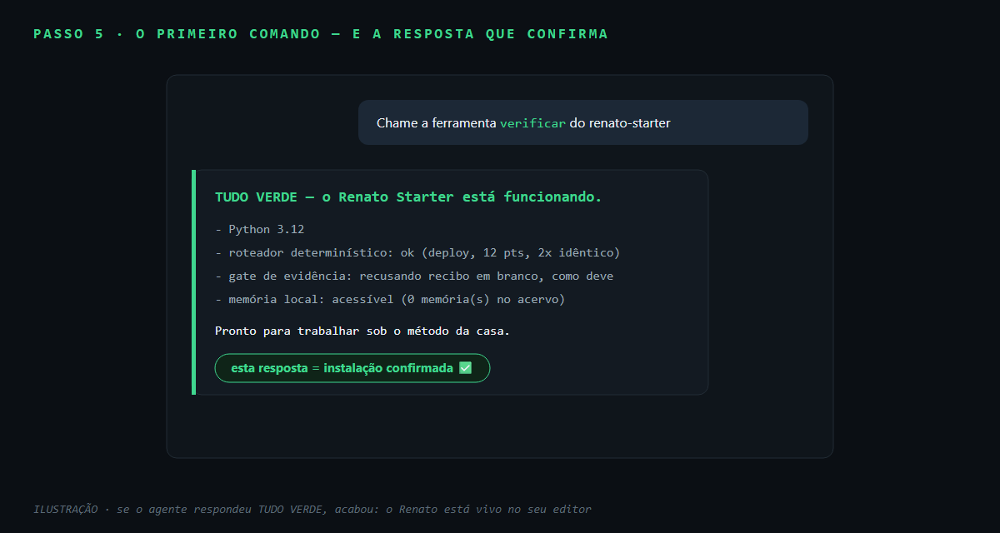

# Do zero ao Renato funcionando — guia para quem nunca programou

Este guia leva você do **download** até o **primeiro comando funcionando no
Antigravity**, sem precisar saber programar. São 5 passos, ~10 minutos.
Em cada passo tem um ✅ dizendo como saber que deu certo antes de seguir.

> Já é dev? Atalho: `git clone` → `INSTALAR.bat` (ou `pip install -r requirements.txt`
> + `pytest`) → cole `config_antigravity.json` no seu editor. As seções técnicas
> estão [no final](#para-quem-é-técnico).

---

## Passo 1 — Baixar o projeto (sem precisar de git)

1. Abra [github.com/ErickWilliamDeSousa/renato](https://github.com/ErickWilliamDeSousa/renato)
2. Clique no botão verde **`<> Code`** (canto direito, em cima da lista de arquivos)
3. Clique em **Download ZIP**
4. Abra a pasta Downloads, clique com o **botão direito** no arquivo
   `renato-main.zip` → **Extrair Tudo...** → em "Selecione um destino", apague o
   que estiver lá, digite só `C:\` → **Extrair**
5. Vai surgir a pasta **`C:\renato-main`** — é a sua pasta do projeto





> **Por que `C:\` e não a Área de Trabalho?** Pastas com acento ou espaço no
> caminho (ex.: `C:\Users\João Silva\Área de Trabalho`) quebram algumas
> ferramentas. `C:\renato-main` é curto e à prova de erro.

**✅ Deu certo se:** existe a pasta `C:\renato-main` e dentro dela você vê
`starter`, `docs`, `README.md`.

## Passo 2 — Instalar o Python (uma vez só; pule se já tem)

O Python é o motor que roda o Renato. Instalar é como qualquer programa:

1. Abra [python.org/downloads](https://www.python.org/downloads/) e clique no
   botão amarelo **Download Python 3.x**
2. Abra o arquivo baixado
3. **⚠️ A PARTE MAIS IMPORTANTE DO GUIA INTEIRO:** na primeira tela do
   instalador, **marque a caixinha** `☑ Add python.exe to PATH`
   (fica embaixo, perto do botão). Só depois clique **Install Now**
4. Espere terminar e feche



> Esqueceu de marcar a caixinha? Não tente consertar: desinstale o Python
> (Configurações → Aplicativos), instale de novo e marque. 2 minutos.

**✅ Deu certo se:** a instalação terminou com "Setup was successful".

## Passo 3 — Duplo clique em `INSTALAR.bat`

1. Abra a pasta `C:\renato-main\starter`
2. Dê **duplo clique** em **`INSTALAR`** (ou `INSTALAR.bat`)
3. Se o Windows mostrar um aviso azul *"O Windows protegeu o computador"*:
   clique em **Mais informações** → **Executar assim mesmo**
   (o arquivo é texto aberto — você pode ler tudo que ele faz)
4. Uma janela preta vai trabalhar por 1–2 minutos

O instalador faz 3 coisas sozinho: instala as bibliotecas, roda os **15 testes**
de saúde, e **gera a configuração do Antigravity já com os caminhos certos do
SEU computador** — copiada para o Ctrl+V e aberta no Bloco de Notas.



**✅ Deu certo se:** a janela mostra **`TUDO PRONTO!`** e o Bloco de Notas abriu
com um texto começando em `"mcpServers"`.

## Passo 4 — Colar a configuração no Antigravity

1. Abra o **Antigravity**
2. No painel do **Agente** (o chat), procure o ícone de **MCP** (parece uma
   tomada/plug) ou vá em **Settings → MCP Servers**
3. Clique em **Manage MCP Servers** → **View raw config** (abre um arquivo de
   configuração)
4. **Cole** (Ctrl+V) o que o instalador copiou.
   - Se o arquivo estava vazio ou só com `{ }`: apague e cole por cima.
   - Se já existiam outros servidores: cole só o bloco `"renato-starter": {...}`
     dentro do `"mcpServers"` existente (o Bloco de Notas que abriu mostra o bloco).
5. **Salve** (Ctrl+S) e clique em **Refresh** na lista de servidores



**✅ Deu certo se:** aparece **`renato-starter`** na lista, com **5 ferramentas**:
`verificar`, `session_start`, `iniciar_tarefa`, `memoria_gravar`, `task_complete`.

## Passo 5 — O primeiro comando (a prova final)

No chat do agente do Antigravity, digite exatamente:

```
Chame a ferramenta verificar do renato-starter
```



**✅ FUNCIONOU se** a resposta for **`TUDO VERDE — o Renato Starter está
funcionando`**, com o resumo (Python, roteador, gate, memória). Essa ferramenta
existe exatamente pra isso: confirmar a instalação sem precisar entender nada
de técnico. 🎉

Agora experimente o método de verdade:

```
Chame a ferramenta session_start do renato-starter com o tema "primeiro teste"
```
→ o agente recebe as **regras da casa** (aceite como contrato, test-first,
segunda versão, evidência) e passa a trabalhar sob elas.

```
Chame iniciar_tarefa com a descrição "fazer o deploy do container em produção"
```
→ volta `Domínio: deploy` com o método cobrado. Rode duas vezes: **a resposta é
idêntica** — mesma entrada, mesmo método, sempre. Bem-vindo ao Renato.

---

## Deu errado? Procure seu sintoma aqui

| O que aconteceu | Causa | O que fazer |
|---|---|---|
| Duplo clique no INSTALAR.bat abriu a **página do Python** | Python não instalado | é o esperado! siga o Passo 2 e rode de novo |
| `python não é reconhecido` ou abriu a **Loja do Windows** | caixinha do PATH não marcada | desinstale o Python e refaça o Passo 2 marcando a caixinha |
| A janela preta **fechou sozinha** rapidinho | erro antes do pause | abra a pasta no Explorador, digite `cmd` na barra de endereço, Enter, digite `INSTALAR.bat` — a mensagem fica na tela; mande uma foto para quem te indicou |
| `Algum teste falhou` | download incompleto ou antivírus | baixe o ZIP de novo e reextraia; rode o INSTALAR.bat de novo |
| `renato-starter` **não aparece** no Antigravity | colou no lugar errado ou não salvou | refaça o Passo 4 com calma; depois de salvar, clique Refresh; se nada, feche e abra o Antigravity |
| Aparece na lista mas **dá erro ao chamar** | pasta com acento/espaço no caminho | mova a pasta para `C:\renato-main` e rode o INSTALAR.bat de novo (ele regenera a configuração) |
| Letras estranhas (é, ç) na janela preta | codificação do console | não afeta o funcionamento; ignore |

Não achou seu caso? Abra uma [issue no GitHub](https://github.com/ErickWilliamDeSousa/renato/issues)
com uma foto da tela — sem vergonha, o repositório existe pra isso.

---

## Para quem é técnico

> **Atalho dev:** `git clone` → `cd renato/starter` → `pip install -r requirements.txt`
> → `pytest -q` (15 verdes) → aponte seu cliente MCP para `python servidor_mcp.py`.
> A tabela `DOMINIOS`/`PACOTES`, os gates puros e o leak-scan estão em ~300 linhas
> legíveis — leia antes de estender.
>
> Quer o desenho completo (RRF, decisões de engenharia, como o starter vira
> produção)? **[Deep-dive de engenharia](../docs/ENGENHARIA.md)**.

### O mapa da semente

| Arquivo | Conceito que demonstra |
|---|---|
| `servidor_mcp.py` | identidade injetada na conversa + as 5 ferramentas (inclui `verificar`, a prova de vida) |
| `roteador.py` | classificação determinística — zero LLM no caminho crítico |
| `memoria.py` | acervo local SQLite/FTS5 + leak-scan na ingestão (`[REDACTED]` antes do disco) |
| `gates.py` | gates como funções puras — recusa recibo em branco |
| `instalar.py` / `INSTALAR.bat` | onboarding de 1 clique: deps + testes + config gerada por máquina |
| `templates/` | os artefatos: GSD, plano de teste, recibo, AGENTS.md |
| `tests/test_smoke.py` | o método aplicado a si mesmo: nasceu test-first (15 testes) |

### Outros editores (mesmo padrão: comando + args via stdio)

O `config_antigravity.json` gerado serve de base — o formato muda pouco:

- **Claude Code:** `claude mcp add renato-starter -- python C:/renato-main/starter/servidor_mcp.py`
- **Cursor:** cole o mesmo JSON em `~/.cursor/mcp.json`
- **VS Code:** em `.vscode/mcp.json`, troque `"mcpServers"` por `"servers"` e
  adicione `"type": "stdio"` no servidor

### Usando os templates no seu projeto

Copie `templates/` para `.renatao/` no seu projeto: `GSD_TASK.md` antes da
primeira linha, `TEST_FIRST_PLAN.md` antes de implementar, `EXECUTION_RECEIPT.md`
antes do "pronto", `AGENTS.md` na raiz do repo.

### Estendendo a semente

- **Novo domínio**: entrada em `DOMINIOS` + pacote em `PACOTES` (`roteador.py`) — teste primeiro
- **Nova regra de identidade**: `IDENTIDADE` em `servidor_mcp.py` — verbo e consequência, não conselho
- **Novo padrão de segredo**: regex em `PADROES_SEGREDO` (`memoria.py`) + teste provando a redação
- **Novo gate**: função pura em `gates.py` + wrapper de uma linha no servidor

### O caminho de evolução (na ordem que compensa)

1. **Colheita automática** — extrair decisões estruturadas de cada `task_complete`
2. **Evals por projeto** — casos `comando → saída esperada` que bloqueiam deploy
3. **Checkpoints como gates** — pre-code, pre-test, pre-commit recusando etapa pulada
4. **Recall semântico** — embeddings + fusão RRF sobre o FTS5 ([como funciona](../docs/ENGENHARIA.md#5-memória-leak-scan-na-ingestão--recall-híbrido))
5. **Selo do projeto** — nota A–F determinística, medida no tempo

> A regra de ouro: **cada prática só está pronta quando virou mecanismo** —
> algo que bloqueia, não que aconselha.
